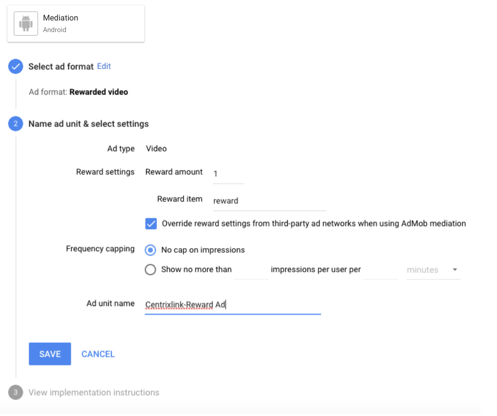
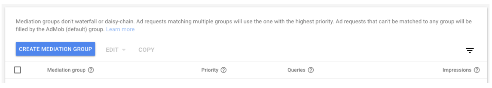
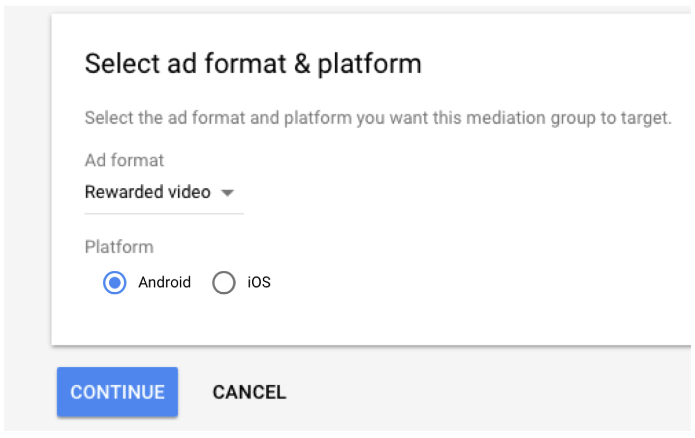
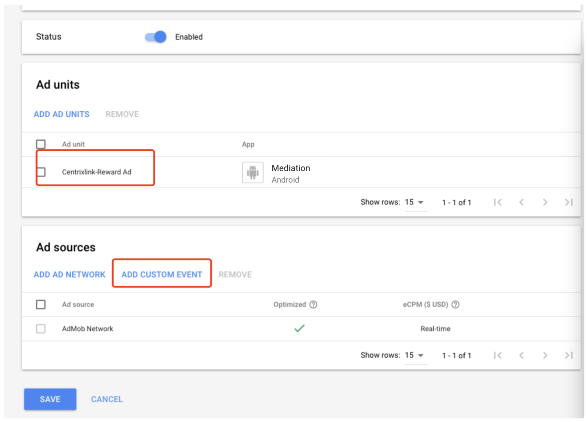
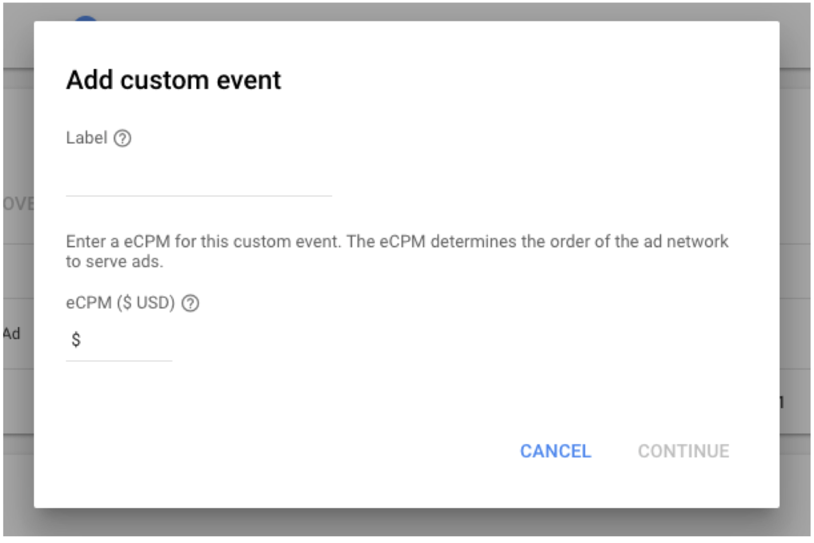
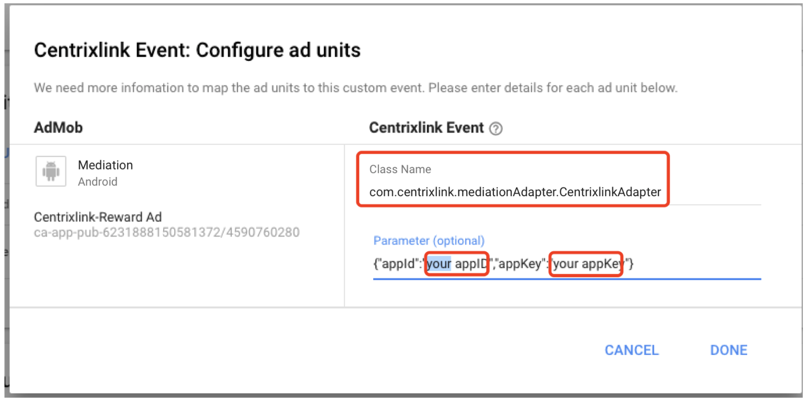
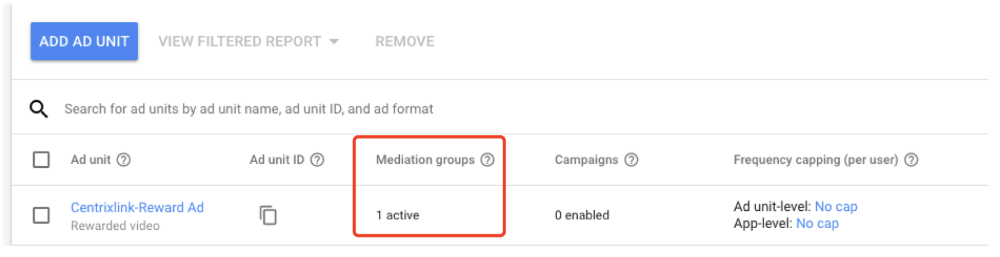

# Mediation for SDK 2.4 Document


### 步骤1: 前往AdMob，将Centrixlink添加到Mediation group


##### 1. 登录AdMob，并前往Apps选项卡，创建应用和广告单元

##### 2. 前往Mediation选项卡，点击CREATE MEDIATION GROUP
!


##### 3. 选择广告格式和应用平台



##### 4. 添加Ad sources
!
##### 5. ADD CUSTOM EVENT

##### 6. 填写参数如下（注意Class Name不能修改，并且将appID和appkey替换成你在Centrixlink平台申请的appID和appkey）

##### 7. 点击Done后，如果成功你会发现你的广告单元下会出现如图所示



### 步骤2: 集成Centrixlink Adapter和SDK

##### 1. 下载[Centrixlink Adapter](https://github.com/centrixlink/AdMob-Android-Adapter)，然后添加到你的项目。

##### 2. 集成Centrixlink iOS SDK到你的项目中，请遵循“[Centrixlink -Android SDK 文档](https://github.com/centrixlink/Centrixlink-Android-SDK)”的说明。


### 步骤3: 播放激励视频广告
##### 1. 初始化RewardedVideoAd

```Objc
 private RewardedVideoAd mAd;
```
```Objc
// Check Google Play Services availability
GoogleApiAvailability apiAvailability = GoogleApiAvailability.getInstance();
int errorCode = apiAvailability.isGooglePlayServicesAvailable(this);
apiAvailability.showErrorDialogFragment(this, errorCode, 0);

//RewardedVideoAd init
mAd = MobileAds.getRewardedVideoAdInstance(this);
mAd.setRewardedVideoAdListener(mRewardedVideoAdListener);
```
##### 2. 設定廣告相關生命週期，必須在Activity的onResume與onPause中呼叫RewardedVideoAd的resume與pause

```Objc
@Override
protected void onResume() {
    super.onResume();
    if(mAd != null){
        mAd.resume();
    }
}

@Override
protected void onPause() {
    super.onPause();
    if(mAd != null){
        mAd.pause();
    }
}
```

##### 3. 載入廣告
```Objc
public void load(View view) {
    log("Loading reward-based ad…");
    Bundle extras = getNetworkExtras();
    AdRequest adRequest = new AdRequest.Builder()
            .addNetworkExtrasBundle(CentrixlinkAdapter.class, extras)
            .build();
    showRewardedVideoAdButton.setText(R.string.ad_loading);
    showRewardedVideoAdButton.setEnabled(false);
    mAd.loadAd(mAdUnitIdRewardBased, adRequest);
}
```
##### 4. 播放廣告
```Objc
public void show(View view) {
    log("Showing reward-based ad…");
    mAd.show();
}
```
### 客制化AdConfig
##### 广告播放可使用addNetworkExtrasBundle設定客製化AdConfig，若無設定則使用預設值
```Objc
public void load(View view) {
    log("Loading reward-based ad…");
    Bundle extras = getNetworkExtras();
    AdRequest adRequest = new AdRequest.Builder()
            .addNetworkExtrasBundle(CentrixlinkAdapter.class, extras)
            .build();
    showRewardedVideoAdButton.setText(R.string.ad_loading);
    showRewardedVideoAdButton.setEnabled(false);
    mAd.loadAd(mAdUnitIdRewardBased, adRequest);
}
    
private Bundle getNetworkExtras() {
    Bundle extras = null;

    //you can compose your customize AdConfig here and put
    AdConfig config = new AdConfig();
    config.setOptionKeyUser(this.getPackageName());

    extras = new Bundle();
    extras.putSerializable(CentrixlinkAdapter.KEY_CUSTOM_AD_CONFIG, config);

    return extras;
}
```


